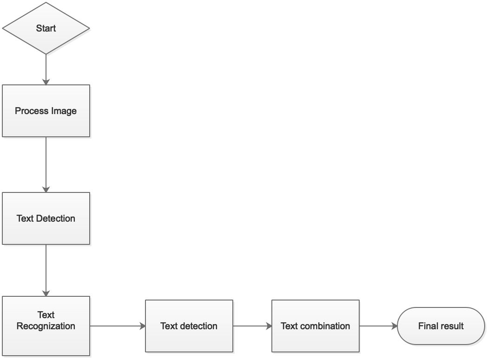

# Digitizing Receipt
Vietnamese Receipt OCR Scanner=

## Presiquitive
- Docker
- docker-compose 

# Run the server
```
docker-compose up
```
and go to [localhost:8000](http://localhost:8000)

# Online Server
https://hung-ocr.herokuapp.com


## Training
### Presiquitive
- jupyter-notebook
- keras
- tensorflow

## LSTM Intent Classification Training
You can find the LSTM classification usage in [here](trainning/text_classification)

The best train at [here](trainning/text_classification/Train vi final.ipynb)

## For running the code without server
### Presiquitive
Install python3 libs in [requirements.txt](main/requirements.txt)  
### Run
```
main/main.py
```  


## Installation
You can run ```python3 setup-linux.py``` or follow instruction below:

Package using : [tesseract-ocr](https://github.com/tesseract-ocr/tesseract)

- Install tesseract on linux 18
```
sudo apt install tesseract-ocr
```

- Install Vietnamese languagues data pack from [VietUnicode](http://vietunicode.sourceforge.net/howto/tesseract-ocr.html)

```
sudo apt-get install tesseract-ocr-vie
```
- Install ImageMagick

- Install Python requirements
```
pip3 install -r main/requirements.txt
```

# Flow chart



<!-- 
## **Step 1:** Convert Scanned PDF to xml (deprecated)
[Folder](main/converter)  
[Document](main/converter/README.md)  
Usage:
`-m` : Method
`-i` : Image Source
`-o` : Ouput Path (Print out if None)
`-ot`: Output type: xml or str 

Method 0:
```
python3 main/converter.py -m 0 -i ../stock/don-thuoc.png -ot str
```
Method 1:
```
python3 main/converter.py -m 1 -i ../stock/don-thuoc.png -o test.html -ot xml
```
Method 2:
```
python3 main/converter.py -m 2 -i ../stock/don-thuoc.png -o test.html -ot xml
```

or to have more setting:  
```
python3 main/converter.py -h
``` -->

